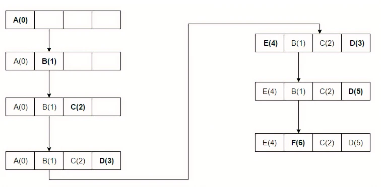

<h1 style="text-align: center;">
	<a href='https://intranet.alxswe.com/projects/1236'>
		Caching Algorithms
	</a>
</h1>

# Cache Replacement Policies

_Cache algorithms_ aka `cache replacement algorithms` or `cache replacement policies` are optimizing instructions, or algorithms, that a computer program or a hardware-maintained structure can utilize in order to manage a cache of information stored on the computer.

Caching improves performance by keeping recent or often-used data items in memory locations that are faster or computationally cheaper to access than normal memory stores. When the cache is full, the algorithm must choose which items to discard to make room for the new ones.

## Simple queue-based policies

### First in first out (FIFO)

Using this algorithm the cache behaves in the same way as a `FIFO` queue.

The cache evicts the blocks in the order they were added, without any regard to how often or how many times they were accessed before.

### Last in first out (LIFO) or First in last out (FILO)

Using this algorithm the cache behaves in the same way as a stack and opposite way as a FIFO queue. The cache evicts the block added most recently first without any regard to how often or how many times it was accessed before.

## Simple recency-based policies

### Least recently used (LRU)

Discards or removes the least recently used items first thus keeping frequently used data.

This algorithm requires keeping track of what was used when, which is expensive if one wants to make sure the algorithm always discards the least recently used item. General implementations of this technique require keeping "age bits" for cache-lines and track the "Least Recently Used" cache-line based on age-bits. In such an implementation, every time a cache-line is used, the age of all other cache-lines change.  

The access sequence for the below example is A B C D E D F

  

**L**east **R**ecently **U**sed (LRU) algorithm is a Greedy algorithm where the page to be replaced is least recently used.  

Consider the following reference string:  1, 2, 3, 4, 1, 2, 5, 1, 2, 3, 4, 5

Find the number of page faults using the least recently used (LRU) page replacement algorithm with 3-page frames. 

Below is the illustration of the above approach:

  

  

  

[Read more](https://www.geeksforgeeks.org/lru-cache-implementation/ "https://www.geeksforgeeks.org/lru-cache-implementation/")

### 

* * *

### Most recently used (MRU)

In contrast to Least Recently Used (LRU), MRU discards the most recently used items first. 

The access sequence for the below example is A B C D E C D B.

  

## Simple frequency-based policies

### Least-frequently used (LFU)

LFU  is a caching algorithm in which the least frequently used cache block is removed whenever the cache is overflowed. Counts how often an item is needed. Those that are used least often are discarded first.

In LFU we check the old page as well as the frequency of that page and if the frequency of the page is larger than the old page we cannot remove it and if all the old pages are having same frequency then take last i.e FIFO method for that and remove that page.

This works very similar to LRU except that instead of storing the value of how recently a block was accessed, we store the value of how many times it was accessed. So of course while running an access sequence we will replace a block which was used fewest times from our cache. E.g., if A was used (accessed) 5 times and B was used 3 times and others C and D were used 10 times each, we will replace B.

  

[Read more](https://www.geeksforgeeks.org/least-frequently-used-lfu-cache-implementation/ "https://www.geeksforgeeks.org/least-frequently-used-lfu-cache-implementation/")

### Author(s)

[**Emmanuel Fasogba**](https://www.linkedin.com/in/emmanuelofasogba/)
- GitHub - [fashemma007](https://github.com/fashemma007)
- Twitter - [@tz_emiwest](https://www.twitter.com/tz_emiwest)
